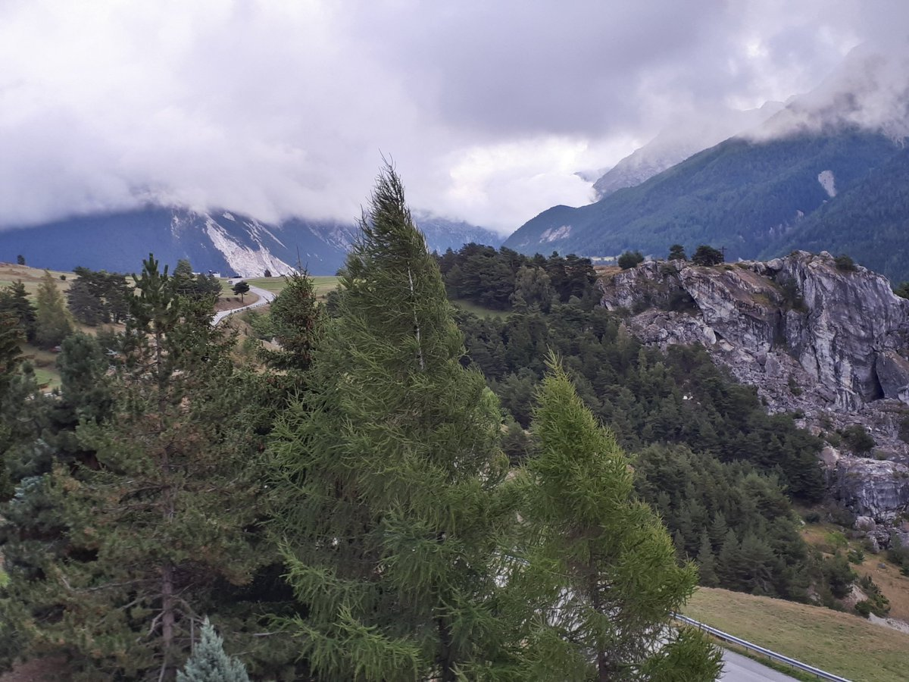

#Introduction

## Principle of pcadapt 

1. Use Principal Component Analysis to ascertain population structure.

2. For each SNP, compute associations betwen Principal Components and SNP variation.

3. Consider as candiates for adaptation, outlier SNPs with atypical (i.e. excess of) association with PCs.

## Advantages of pcadapt 

1. It is fast and can handle large-scale data generated with next-generation technologies.

2. By contrast to population-based approaches ($F_{ST}$), the package can handle admixed individuals and does not require to group individuals into predefined populations.

3. When hierarchical population structure (e.g. population divergence with 3 or more pops, range expansion), it generates less false discoveries than $F_{ST}$.

4. There is a nice [vignette](https://cran.r-project.org/web/packages/pcadapt/vignettes/pcadapt.html) that explains how to use the software.

5. [Keurcien Luu](https://github.com/keurcien) is in the room, he develops the R package and can answer questions.

## Some maths

1. For each SNP, *pcadapt* computes a vector of z-scores $(z_1,\dots,z_K)$ that corresponds to the z-scores obtained when regressing a SNP by the $K$ PC.

2. Robust [Mahalanobis distances](https://en.wikipedia.org/wiki/Mahalanobis_distance) are computed based on all vectors of z-scores.

3. Mahalanobis distance can be approximated by a constant (genomic inflation factor) times a chi-square distribution with $K$ degrees of freedom.

#Using pcadapt to look for local adaptation in populations of Dahu 


##Choice of the number $K$ of PCs


```{r,eval=FALSE,echo=FALSE}
install.packages("devtools")
devtools::install_github("bcm-uga/pcadapt")
```

```{r,message=FALSE,echo=FALSE,,results="hide"}
training<-readRDS("sim1a.rds")
require(pcadapt)
aux<-pcadapt(training$G,K=30)
```

```{r,warning=FALSE,message=FALSE,fig.height = 2.5, fig.width = 4.5}
plot(aux,option="screeplot")
```

According to Cattell’s rule, eigenvalues that correspond to random variation lie on the straight line whereas the ones corresponding to population structure depart from the line -> $K=4$ 

##Population structure ascertained with PCA

```{r,echo=FALSE}
pop<-read.table("outputIndAll_pop_sim1a.txt",header=T)$pop
```

```{r,results="hide",fig.height = 3, fig.width = 5}
res<-pcadapt(training$G,K=4)
plot(res,option="scores",pop=pop)
```

##Calibration of p-values 

```{r,results="hide",fig.height = 3, fig.width = 5}
hist(res$pvalues,breaks=50)
```

The distribution is uniform excess for an excess of small P-values (outliers).

##Choice of threshold for outlier detection

```{r,echo=FALSE,message=F}
require(qvalue)
```

```{r,fig.height = 2.5, fig.width = 4.5}
plot(qvalue(res$pvalues))
```
->Keep around 200 SNPs

```{r}
write(order(res$pvalues)[1:200],"submission.txt",ncolumns=1)
```

# Accounting for LD in pcadapt (to be included soon in the R package)

##SNP pruning and PCA

```{r,eval=FALSE,echo=FALSE}
devtools::install_github("privefl/bigsnpr")
library(bigsnpr)
```

```{r,results="hide",warning=FALSE,message=FALSE,echo=FALSE}
library(bigstatsr)
library(bigsnpr)
G<-add_code256(big_copy(t(training$G),type="raw"),code=bigsnpr:::CODE_012)
```

```{r,results="hide",warning=FALSE,message=FALSE,echo=FALSE,fig.height = 3, fig.width = 5}
newpc<-snp_autoSVD(G=G,infos.chr =training$chromosome,infos.pos = training$position)
plot(newpc)
```

Catell's rule after SNP pruning->  $K=1$.


##Calibration of p-values 

```{r,fig.height = 3, fig.width = 5}
gwas<-snp_gc(snp_pcadapt(G,U.row = newpc$u[,1]))
pval<-predict(gwas,log10=F)
hist(pval,breaks=50)
```

The distribution is uniform excess for an excess of small P-values (outliers).

##Choice of threshold for outlier detection

```{r,fig.height = 2.5, fig.width = 4.5}
plot(qvalue(pval))
```
-> Keep around 50 SNPs.

```{r}
write(ou<-order(pval)[1:50],"submission_LD.txt",ncolumns=1)
```

##Manhattan plot
```{r,fig.height = 3, fig.width = 5}
CHR<-training$chromosome
snp_manhattan(gwas , CHR, unlist(tapply(CHR, CHR, seq_along)), 
              dist.sep.chrs = 100,ind.highlight = ou) 
```
```

##Shitty weather


Light Rain in Wednesday and heavy Rain on Thursday.

